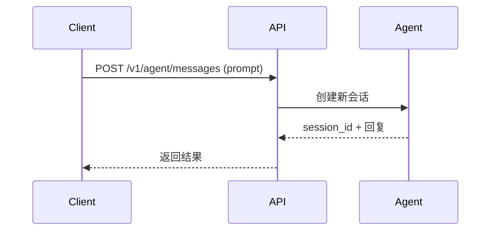
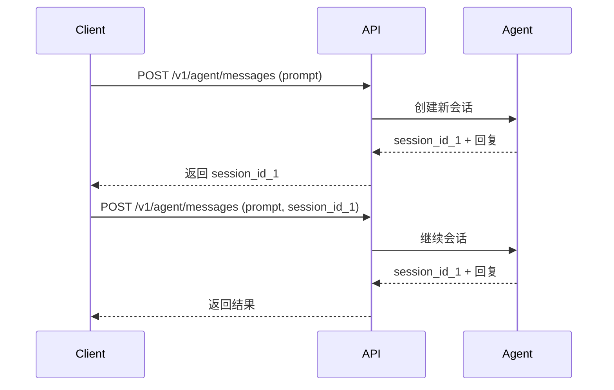
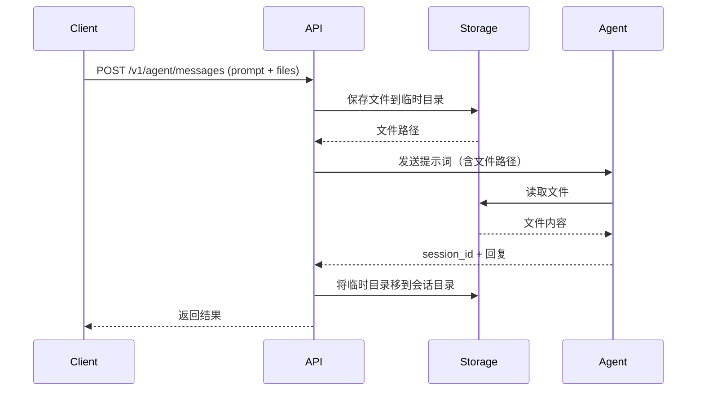

# API Reference

本文档描述了 Agent SDK API Service 提供的所有 HTTP 接口。

## 基础信息

- **Base URL**: `http://localhost:8000`
- **Content Type**: `application/json` (除文件上传接口使用 `multipart/form-data`)

## 接口列表

### 1. 健康检查

获取服务健康状态。

**请求**

```http
GET /
```

**响应**

```json
{
  "status": "healthy",
  "service": "agent-sdk-api-service",
  "version": "0.1.0"
}
```

---

### 2. 获取配置信息

获取当前服务的配置信息，包括使用的模型、Provider 等。

**请求**

```http
GET /config
```

**响应**

```json
{
  "model": "claude-sonnet-4-5",
  "provider": "Vertex AI",
  "max_turns": 25,
  "permission_mode": "acceptEdits",
  "vertex_project_id": "ai-model-487001",
  "region": "global"
}
```

**字段说明**

- `model`: 使用的 Claude 模型
- `provider`: Provider 类型
  - `Vertex AI`: Google Cloud Vertex AI
  - `AWS Bedrock`: AWS Bedrock
  - `Anthropic Foundry`: Anthropic Foundry
  - `Local Proxy`: 本地代理服务
- `max_turns`: 最大对话轮次
- `permission_mode`: 权限模式
- `vertex_project_id`: GCP 项目 ID（仅 Vertex AI）
- `region`: 区域（仅 Vertex AI）

---

### 3. 测试页面

访问 Web 测试页面。

**请求**

```http
GET /test
```

**响应**

返回 HTML 测试页面，提供可视化的接口测试界面。

---

### 4. 创建 Agent 消息

向 Claude Agent 发送消息并获取响应。支持多轮对话和文件上传。

**请求**

```http
POST /v1/agent/messages
Content-Type: multipart/form-data
```

**参数**

| 参数 | 类型 | 必需 | 说明 |
|------|------|------|------|
| `prompt` | string | 是 | 发送给 Agent 的提示词 |
| `session_id` | string | 否 | 会话 ID，用于继续多轮对话 |
| `files` | file[] | 否 | 上传的文件列表 |

**请求示例（cURL）**

```bash
# 创建新会话
curl -X POST http://localhost:8000/v1/agent/messages \
  -F "prompt=你好，请介绍一下你自己" \
  -F "files=@document.pdf"

# 继续会话
curl -X POST http://localhost:8000/v1/agent/messages \
  -F "prompt=请总结刚才上传的文件" \
  -F "session_id=abc123-session-id"
```

**响应**

```json
{
  "session_id": "abc123-session-id",
  "final_answer": "你好！我是 Claude，一个由 Anthropic 开发的 AI 助手...",
  "steps": [
    {
      "type": "TaskStartedMessage",
      "content": "TaskStartedMessage(session_id='abc123-session-id')"
    },
    {
      "type": "AssistantMessage",
      "content": "AssistantMessage(content=[TextBlock(text='你好！我是 Claude...', type='text')])"
    }
  ],
  "success": true
}
```

**字段说明**

- `session_id`: 会话 ID，用于后续对话
- `final_answer`: Agent 的最终回复文本
- `steps`: 执行步骤列表（可选，根据配置）
  - `type`: 消息类型
  - `content`: 消息内容预览
- `success`: 执行是否成功

**错误响应**

```json
{
  "detail": "Agent 执行失败: 错误详情"
}
```

---

## 工作流程

### 单轮对话



### 多轮对话



### 文件上传工作流



---

## 配置说明

### Vertex AI 模式

当配置为 Vertex AI 模式时：

1. `provider` 返回 `"Vertex AI"`
2. 响应中包含 `vertex_project_id` 和 `region`
3. Agent 通过 Google Cloud Vertex AI 调用 Claude 模型

### 本地代理模式

当配置为本地代理模式时：

1. `provider` 返回 `"Local Proxy"`
2. `vertex_project_id` 和 `region` 为 `null`
3. Agent 通过本地代理服务（如 OpenAI 兼容服务）调用模型

---

## 最佳实践

### 1. 多轮对话

保存第一次请求返回的 `session_id`，后续请求带上此 ID：

```javascript
// 第一次请求
const response1 = await fetch('/v1/agent/messages', {
  method: 'POST',
  body: formData
});
const data1 = await response1.json();
const sessionId = data1.session_id;

// 后续请求
const formData2 = new FormData();
formData2.append('prompt', '继续上一个话题');
formData2.append('session_id', sessionId);

const response2 = await fetch('/v1/agent/messages', {
  method: 'POST',
  body: formData2
});
```

### 2. 文件上传

```javascript
const formData = new FormData();
formData.append('prompt', '请分析这些文件');
formData.append('files', file1);
formData.append('files', file2);

const response = await fetch('/v1/agent/messages', {
  method: 'POST',
  body: formData
});
```

### 3. 错误处理

```javascript
try {
  const response = await fetch('/v1/agent/messages', {
    method: 'POST',
    body: formData
  });

  const data = await response.json();

  if (!response.ok) {
    throw new Error(data.detail);
  }

  if (!data.success) {
    console.warn('Agent 执行有错误:', data.final_answer);
  }

  console.log('回复:', data.final_answer);
} catch (error) {
  console.error('请求失败:', error.message);
}
```

---

## 测试工具

### Web 测试页面

访问 `http://localhost:8000/test` 使用可视化测试界面：

- 输入提示词
- 上传文件
- 查看配置信息
- 显示执行步骤
- 多轮对话测试

### Python 测试脚本

```python
import httpx

async with httpx.AsyncClient() as client:
    # 创建新会话
    response = await client.post(
        "http://localhost:8000/v1/agent/messages",
        data={"prompt": "你好，请介绍一下你自己"}
    )
    data = response.json()
    print(f"Session ID: {data['session_id']}")
    print(f"回复: {data['final_answer']}")

    # 继续会话
    response = await client.post(
        "http://localhost:8000/v1/agent/messages",
        data={
            "prompt": "请用一句话总结你的特点",
            "session_id": data['session_id']
        }
    )
    data = response.json()
    print(f"回复: {data['final_answer']}")
```

---

## 故障排查

### 1. 配置检查

```bash
curl http://localhost:8000/config
```

确认 `provider` 和 `model` 配置正确。

### 2. 健康检查

```bash
curl http://localhost:8000/
```

确认服务正常运行。

### 3. Vertex AI 认证

如果使用 Vertex AI，确保：

```bash
# 检查凭证文件
ls -la ~/.config/gcloud/application_default_credentials.json

# 测试认证
gcloud auth application-default print-access-token
```

---

## 更多信息

- [Vertex AI 配置说明](./VERTEX_AI_SETUP.md)
- [项目 README](./README.md)
- [Claude Agent SDK 文档](https://github.com/anthropics/claude-agent-sdk-python)
